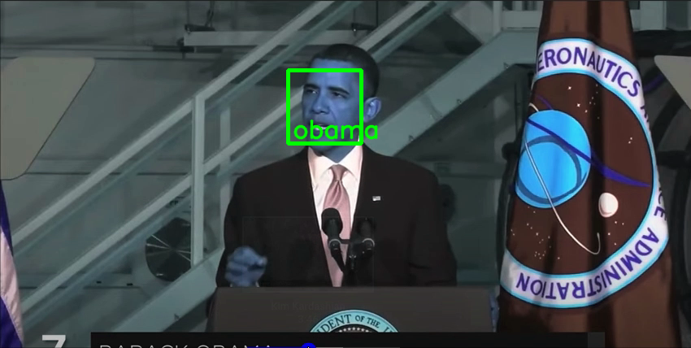

# CV-object-detection

This repository includes the following scripts:
* license_plate_detection.py - Detect and read license plates in a video file
* object_detection.py - Detect objects in a video file
* face_detection.py - Recognize faces in a video file

## Read License Plates
This script reads the video file, looks for license plates and if found, write the image of the frame 
with bounding boxes and also a csv with list of plates detected and their corresponding images

cmd to run
```console 
python license_plate_detection.py --input-file-path <video-file-path> --output-dir <output-dir-path>
```
Example output


## Detect Objects
This script reads the video file, looks for objects and if found, write the image of the frame 
with bounding boxes

The script uses pretrained mobilenet model. The model weights and graph are in mobilenet_model folder

cmd to run
```console 
python object_detection.py --input-file-path <video-file-path> --output-dir <output-dir-path> --model-weights-path 'mobilenet_model/frozen_inference_graph.pb' --model-graph-path 'mobilenet_model/graph.pbtxt'
```
Example output


## Recognize faces
This script reads the video file, looks for faces, compares the faces with known faces and if there is a match then 
writes an image with bounding boxes and the filename of the known face image

The script uses [face-recognition python library](https://pypi.org/project/face-recognition/) 
Known persons directory should have images with filname in the format {person_name}.{format}
cmd to run
```console 
python face_detection.py --input-file-path <video-file-path> --known-persons-dir '<known-faces-dir> --output-dir <output-dir-path>
```
Example output
